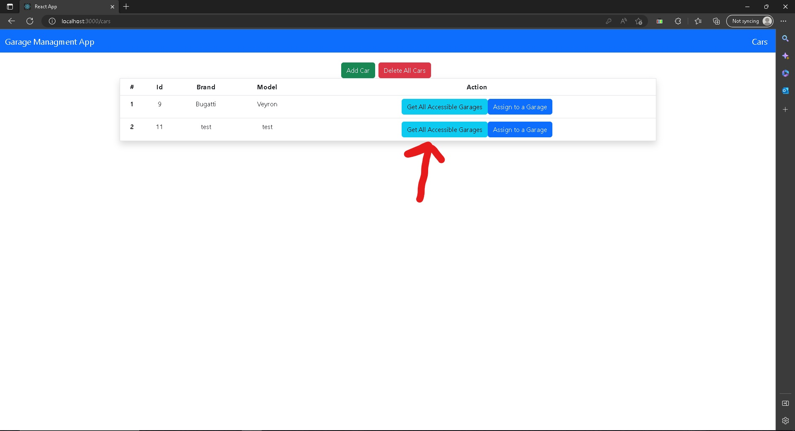
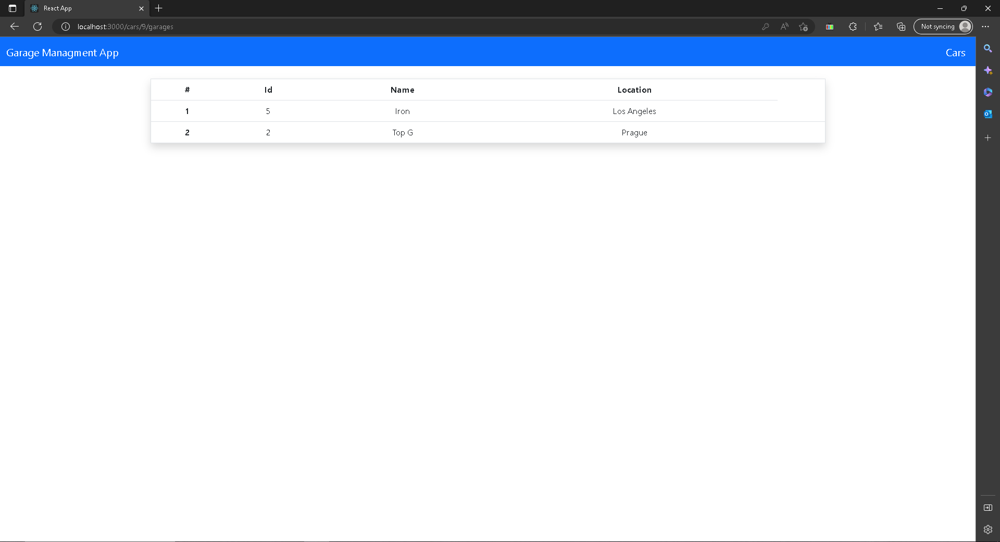

# LamboApi 

##LamboApi is an application to keep track of cars that has access to garages in able to park.

On this page user will be asked for username and password in order to log in to page.(username = "username", password = "password")

This is applications main page where list of owners are being shown.

Add Owner button will open a page where the user could create an owner with specified name and surname.

View Owner button will open a page where the user could see the details of the user.

Edit Owner button will open a page where the user could change the name and surname of an owner.

With Delete button an owner can be deleted.

Add Garage button will open a page where the user could add a garage with specified name and location to the owner.

View Garages button will open a page where the user can see the list of the garages that the owner owns.

On View Garages page user can view the details of the garage with View button.

User can delete the garage with Delete button.

User can view the list of the cars that has access to the garage with View Cars button and user can delete a car from garage if that car has only one garages assigned then that car will be removed from car list too.

User can assign a new car with car Id to the garage with Assign Car button.

User can view the list of the cars by clicking cars button.

A new car can be added with Add Car button, user will be asked for a car brand and a car model.

All the cars can be deleted from the list of cars and of course in this case they will be removed from the garages too.

With Get All Accessible Garages we can view the list of the garages that the car has access to.

A new garage can be assigned to a car and respectively the car will be added to specified garages car list.

Asgarkhan Sadigli.

